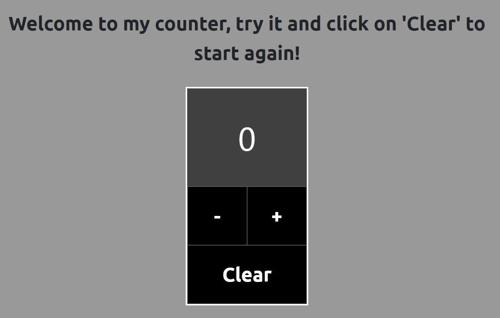
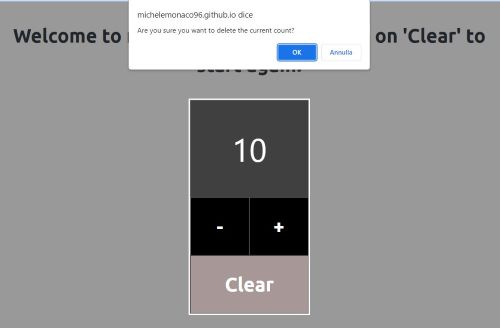

# A simple counter with Javascript
I created a basic counter, using JavaScript to handle interaction with users. It gives you the possibility to increase the current count or decrease it. 
It also gives you the possibility to reset the count, by clicking on "Clear". 

## Built with
For this project, I used the following languages and libraries: 

* JavaScript 
* HTML
* CSS
* SASS
* Bootstrap

## Getting Started

### Installation
As I said before, this project doesn't rely on any external sources but Bootstrap and Sass. If you need further instruction of how you can install them
on your device, you can look at the following resources: 
* [Bootstrap](https://getbootstrap.com/docs/5.0/getting-started/download/)
* [Sass](https://sass-lang.com/install)

After that, you can easily clone the repository with the following command: 
Open Git Bash.

* Change the current working directory to the location where you want the cloned directory
* Type: $ git clone https://github.com/michelemonaco96/counter.git
* Press enter to create your local clone. 

## Usage
The usege of this application is very intuitive and simple. This image shows what you should see when opening it: 

As you can see, there are three buttons that you can click one. You can increase the counter pressing "+" or decrese it pressing "-". 
I have created a button that allows you to reset the current count. When you click on it, you should see an alert asking you to confirm the action. 
If you confirm, the current count will be set to "0", otherwise it will not change. 

_For more examples, please refer to the [Documentation](https://example.com)_

(<a href="#top">back to top</a>)

<!-- ROADMAP -->
## Roadmap

- [x] Add Changelog
- [x] Add back to top links
- [ ] Add Additional Templates w/ Examples
- [ ] Add "components" document to easily copy & paste sections of the readme
- [ ] Multi-language Support
    - [ ] Chinese
    - [ ] Spanish

See the [open issues](https://github.com/othneildrew/Best-README-Template/issues) for a full list of proposed features (and known issues).

(<a href="#top">back to top</a>)

<!-- CONTRIBUTING -->
## Contributing

Contributions are what make the open source community such an amazing place to learn, inspire, and create. Any contributions you make are **greatly appreciated**.

If you have a suggestion that would make this better, please fork the repo and create a pull request. You can also simply open an issue with the tag "enhancement".
Don't forget to give the project a star! Thanks again!

1. Fork the Project
2. Create your Feature Branch (`git checkout -b feature/AmazingFeature`)
3. Commit your Changes (`git commit -m 'Add some AmazingFeature'`)
4. Push to the Branch (`git push origin feature/AmazingFeature`)
5. Open a Pull Request

(<a href="#top">back to top</a>)

## Contact

Project Link: [https://github.com/michelemonaco96/counter](https://github.com/michelemonaco96/counter)

(<a href="#top">back to top</a>)

<!-- ACKNOWLEDGMENTS -->
## Acknowledgments

For this project I looked up these website, which I think are very useful. 

* [W3Schools](https://www.w3schools.com/)
* [JAVASCRIPT.INFO](https://javascript.info/events)
* [MDN Web Docs](https://developer.mozilla.org/en-US/docs/Learn)
