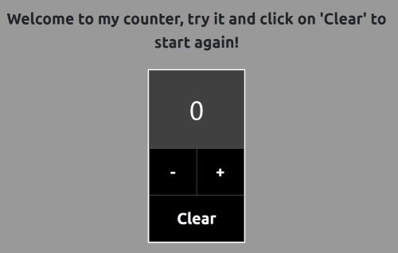

# A simple counter with Javascript
I created a very simple counter, using JavaScript to handle interactions with users. You can increase the current count, decrease it 
and reset it. This last option will require confirmation of the action, in case you clicked on it by mistake. 

## Built with
For this project, I used the following languages and libraries: 

* JavaScript 
* HTML
* CSS
* SASS
* Bootstrap

## Installation
You can run this application on your device very easily. Indeed, you just need the resources listed above. 
If you need further instruction of how you can install Boostrap and Sass on your device, you can look at the following resources: 

* [Bootstrap](https://getbootstrap.com/docs/5.0/getting-started/download/)
* [Sass](https://sass-lang.com/install)

After that, you can clone the repository with the following commands: 

* Open Git Bash.
* Change the current working directory to the location where you want the cloned directory
* Type: $ git clone https://github.com/michelemonaco96/counter.git
* Press enter to create your local clone. 

## Usage
The usege of this application is very intuitive. This image shows what you should see when opening it: 
 

 

As you can see, there are three buttons that you can click on. You can increase the counter pressing "+" or decrese it pressing "-". 
I have created a button that allows you to reset the current count. When you click on it, you should see an alert asking you to confirm the action. 
If you confirm, the current count will be set to "0", otherwise it will not change. 

 

<!-- ROADMAP -->

<!-- CONTRIBUTING -->
## Contributing

I encourage you to contribute to this project, by suggesting for example some styles improvements, refactoring of my code (which may not be great, I am still at
my first experiences with programming!) or by adding some functionalities to my counter, which is indeed very basic.
 
**Any contribution is highly appreciated!**

If you have a suggestion that would make this better, please fork the repo and create a pull request. You can also simply open an issue with the tag "enhancement".

1. Fork the Project
2. Create your Feature Branch (`git checkout -b feature/AmazingFeature`)
3. Commit your Changes (`git commit -m 'Add some AmazingFeature'`)
4. Push to the Branch (`git push origin feature/AmazingFeature`)
5. Open a Pull Request

## Contact
Project Link: [https://github.com/michelemonaco96/counter](https://github.com/michelemonaco96/counter)

## Acknowledgments

For this project I looked up these website, which I think are very useful. 

* [W3Schools](https://www.w3schools.com/)
* [JAVASCRIPT.INFO](https://javascript.info/events)
* [MDN Web Docs](https://developer.mozilla.org/en-US/docs/Learn)
